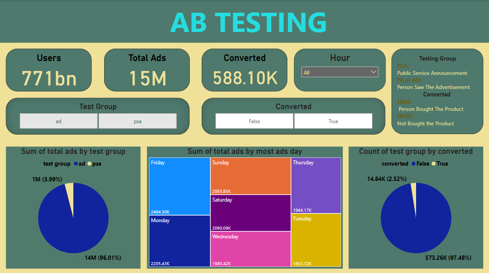

# 📈 **Evaluating Conversion Impact of AD vs. PSA Exposure Using A/B Testing**

## 🛠 **Tools Used**
- **Power BI** – for interactive visualizations and dashboards.
- **Python** – for data analysis and statistical comparison between PSA and PA/AD exposure groups.

## 📊 **Project Overview**
This project focuses on evaluating the conversion impact of **Public Service Announcement (PSA)** versus **Advertisement (PA/AD)** exposure through an **A/B Testing** approach. The goal is to compare the effectiveness of both campaigns based on key performance indicators (KPIs) such as:

📌 **Users**  
💵 **Total Ads**  
🎯 **Converted (Purchases)**  
🛒 **Unique Ads Count**  
💡 **Conversion Rate**  
📦 **Ad Exposure by Day**  

## 🔍 **KPI Comparison Table**

| **Metric**                  | **PSA (Public Service Announcement)** | **PA or AD (Advertisement)** | **PSA + PA/AD (Combined)**  |
|-----------------------------|--------------------------------------|-----------------------------|----------------------------|
| **Users**                   | 21bn                                 | 749bn                       | 771bn                      |
| **Total Ads**               | 582k                                 | 14M                         | 15M                        |
| **Converted (Purchases)**   | 23.52k                               | 564.58k                     | 588.10k                    |
| **Unique Ads (Count)**      | 350 (30%)                            | 803 (69%)                   | 1153                       |
| **Conversion Rate**         | **1.79%**                            | **2.56%**                   | **2.47%**                  |
| **False (Not Converted)**   | 23.1k                                | 550.15k                     | 573.26k                    |
| **True (Converted)**        | 0.42k                                | 14.42k                      | 14.84k                     |
| **Best Day (Highest Exposure)** | Thursday: 104.24k             | Friday: 2464.50k            | Friday: 2464.50k           |

## 📌 **The primary goal** was to compare the effectiveness of PSA and PA/AD exposure based on metrics like:

💰 **Conversion Rate**  
📣 **Reach**  
📈 **Cost per Purchase**  
✅ **Total Conversions**

---

## ✅ **Final Outcome**

- **PA or AD** campaigns outperformed **PSA** with a higher **conversion rate** of **2.56%** compared to **1.79%** for PSA.
- **PA or AD** also had the highest number of **converted purchases**, with **564.58k** conversions.
- The **best performing day** for both campaigns was **Friday**, showing the highest ad exposure and engagement.

Overall, **PA or AD** showed better **ROI** and **conversion performance**, making it the recommended strategy for future digital marketing campaigns.

---

## 📌 **Key Takeaways**
- **A/B Testing** is a critical approach for identifying which marketing strategy delivers the best results.
- **Power BI** dashboards help present complex data in a user-friendly and interactive manner.
- **Python** enables deep analysis, providing valuable insights for statistical comparison.
- By focusing on key metrics like **conversion rate** and **cost per purchase**, businesses can make data-driven decisions for improved marketing effectiveness.

## 🚀 **In Brief**

This project demonstrates how data-driven A/B testing, paired with tools like **Python** and **Power BI**, can optimize digital marketing campaigns. By analyzing exposure and conversion metrics, businesses can confidently choose the best strategy to maximize ROI and drive better results.

---

## 📷 Dashboard Preview

